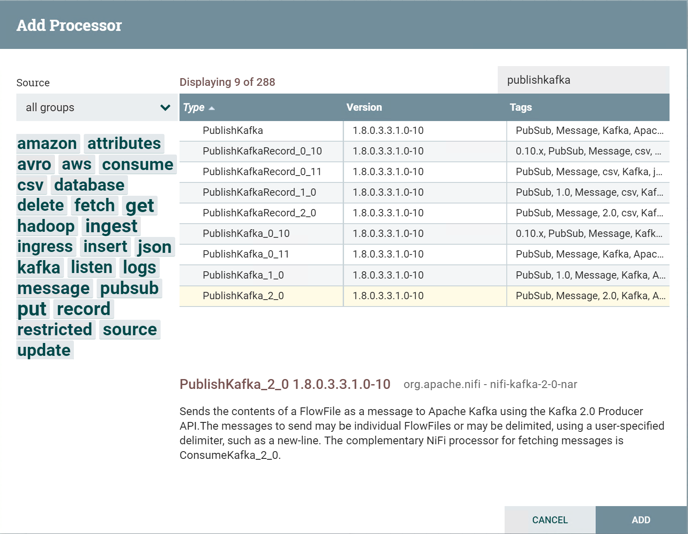
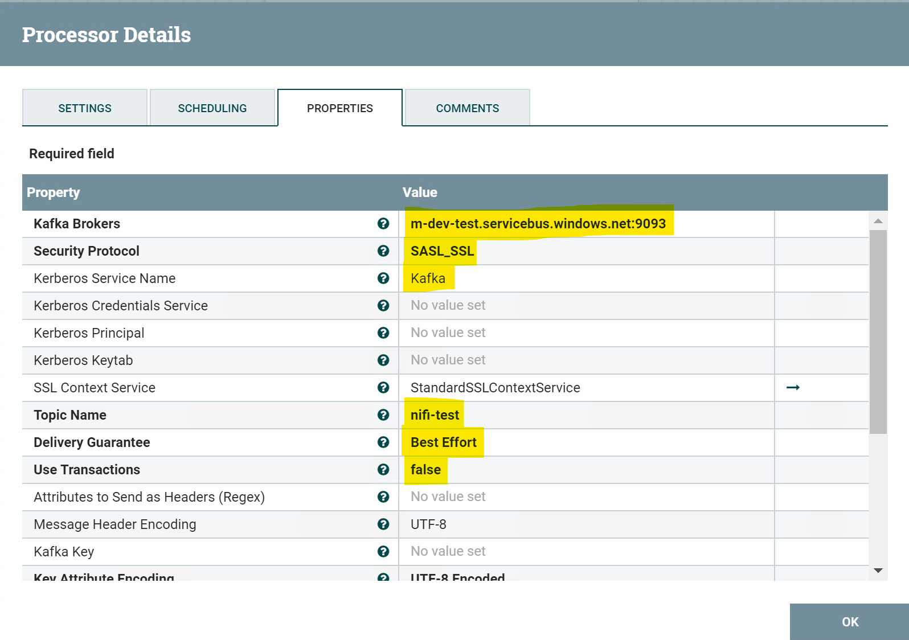
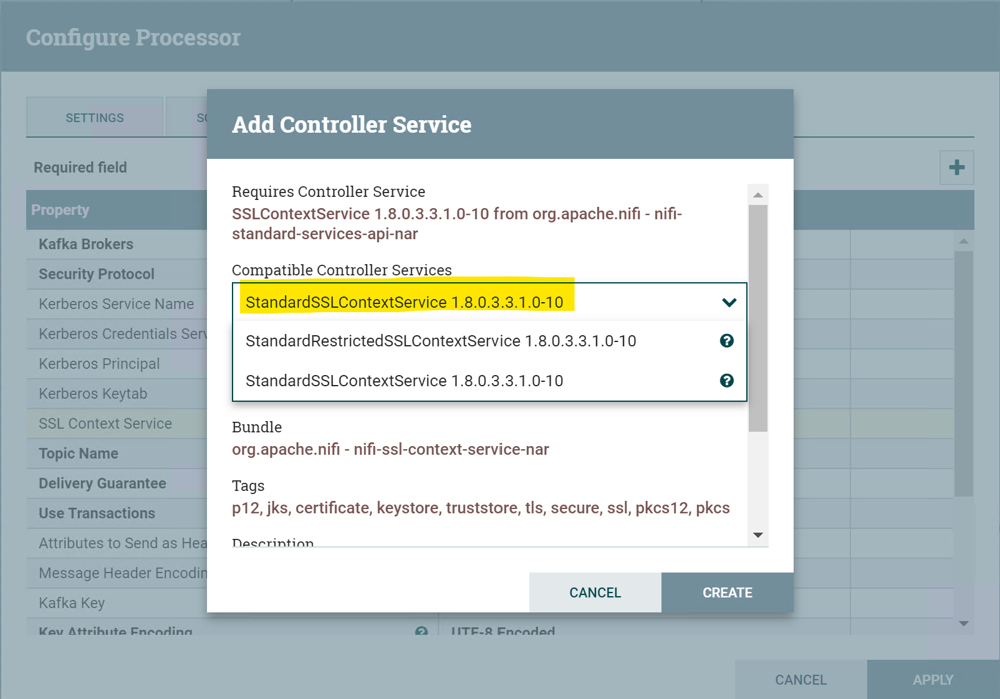
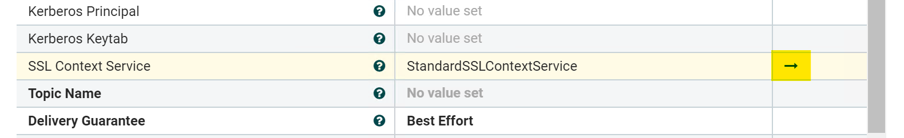
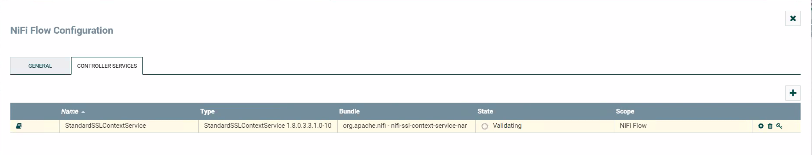
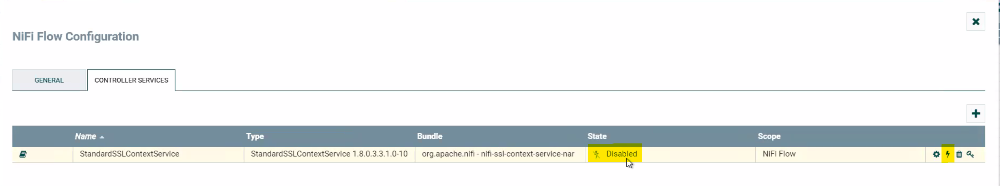
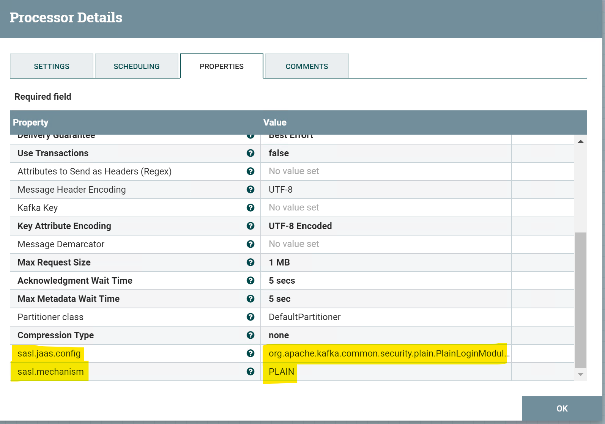

# Using Apache NiFi with Event Hubs for Apache Kafka Ecosystems

This tutorial will show how to connect Apache NiFi to a Kafka-enabled Event Hubs namespace. Azure Event Hubs for Apache Kafka Ecosystems supports [Apache Kafka version 1.0](https://kafka.apache.org/10/documentation.html) and later.

## Prerequisites

If you don't have an Azure subscription, create a [free account](https://azure.microsoft.com/en-us/free/?ref=microsoft.com&utm_source=microsoft.com&utm_medium=docs&utm_campaign=visualstudio) before you begin.

In addition:

* [Java Development Kit (JDK) 1.7+](http://www.oracle.com/technetwork/java/javase/downloads/index.html)
    * On Ubuntu, run `apt-get install default-jdk` to install the JDK.
    * Be sure to set the JAVA_HOME environment variable to point to the folder where the JDK is installed.
* [Download](http://maven.apache.org/download.cgi) and [install](http://maven.apache.org/install.html) a Maven binary archive
    * On Ubuntu, you can run `apt-get install maven` to install Maven.
* [Git](https://www.git-scm.com/downloads)
    * On Ubuntu, you can run `sudo apt-get install git` to install Git.
* [NiFi cluster](https://azuremarketplace.microsoft.com/en-us/marketplace/apps/onyx-point-inc.op-bnf1_6-v1?src=spart&tab=Overview) setup with Kerberos

## Create an Event Hubs namespace

An Event Hubs namespace is required to send or receive from any Event Hubs service. See [Create Kafka-enabled Event Hubs](https://docs.microsoft.com/azure/event-hubs/event-hubs-create-kafka-enabled) for instructions on getting an Event Hubs Kafka endpoint. Make sure to copy the Event Hubs connection string for later use.

### FQDN

For these samples, you will need the connection string from the portal as well as the FQDN that points to your Event Hub namespace. **The FQDN can be found within your connection string as follows**:

`Endpoint=sb://`**`mynamespace.servicebus.windows.net`**`/;SharedAccessKeyName=XXXXXX;SharedAccessKey=XXXXXX`

If your Event Hubs namespace is deployed on a non-Public cloud, your domain name may differ (e.g. \*.servicebus.chinacloudapi.cn, \*.servicebus.usgovcloudapi.net, or \*.servicebus.cloudapi.de).

## Using the NiFi Kafka Publish Processor

Once the NiFi web interface is up and running, select the right Kafka processor.

**Note: Event Hub supports Kafka protocol 1.0.  This tutorial uses the NiFi Kafka PublishKafka_2_0 1.8.0.3.3.1.0-10 processor.**

### Configuring Kafka Processor for NiFi

Update the configuration properties of the processor using below information:

*The screen shots used are of the NiFi Kafka PublishKafka_2_0 1.8.0.3.3.1.0-10 processor*

* Set `Kafka brokers` to the Event Hub FQDN, followed by port 9093 (e.g `mynamespace.servicebus.windows.net:9093`)

* Set `Security protocol` to `SASL_SSL`

* Set `Kerberos Service Name` to `Kafka`

* Set `Topic Name` to your Event Hub name (not the namespace name)

* Set `Delivery Guarantee` to `Best Effort`

* Set `Use Transactions` to `false`

* Configuring SSL Context Service:

    The context service needs to be configured with a valid certstore that can be used to validate the endpoint that will be used to connect to Event Hubs.

    * Select option to Create new service in the SSL Context Service dropdown options

    * Add new `StandardSSLControllerService` from the dropdown on next menu

    

    * Once created, hit the arrow to open the configuration and settings for the `StandardSSLControllerService` just created

    

    * Configure the StandardSSLControllerService with below properties:

        * `Truststore Filename` => use the cert store from your existing Java installation. The following paths are typical for their corresponding operating systems: 

            * **OS X**: /Library/Java/JavaVirtualMachines/jdk<version>.jdk/Contents/Home/jre/lib/security/cacerts
            * **Windows**: C:\Program Files\Java\jdk<version>\jre\lib\security\cacerts
            * **Linux**: /usr/lib/jvm/java-<version>/jre/lib/security/cacerts -- You can additionally use $(readlink -f $(which java))

        * `Truststore Type` => `JKS`

        * `Truststore Password` => The default password is `changeit` if you are using the default keystore

    * Save the `StandardSSLControllerService` configuration just created.
    You may see the configurator get stuck on a "Validating" message - close and reopen the NiFi flow configuration window.

    

    * The `StandardSSLControllerService` may be set to `Disabled` - click the highlighted icon and set to `Enable`.

    

* Using the `+` symbol to add custom properties, add in the following additional custom properties with the values as follows:

    * Set `sasl.jaas.config` to `org.apache.kafka.common.security.plain.PlainLoginModule required username="$ConnectionString" password="Endpoint=sb://mynamespace.servicebus.windows.net/;SharedAccessKeyName=XXXXXX;SharedAccessKey=XXXXXX";`

    * Set `sasl.mechanism` to `PLAIN`

## Using the NiFi ConsumeKafka processor to consume data from Event Hubs

Coming soon!  Authorization should use the same StandardSSLControllerService configuration as the publisher, but configs will otherwise be different.
